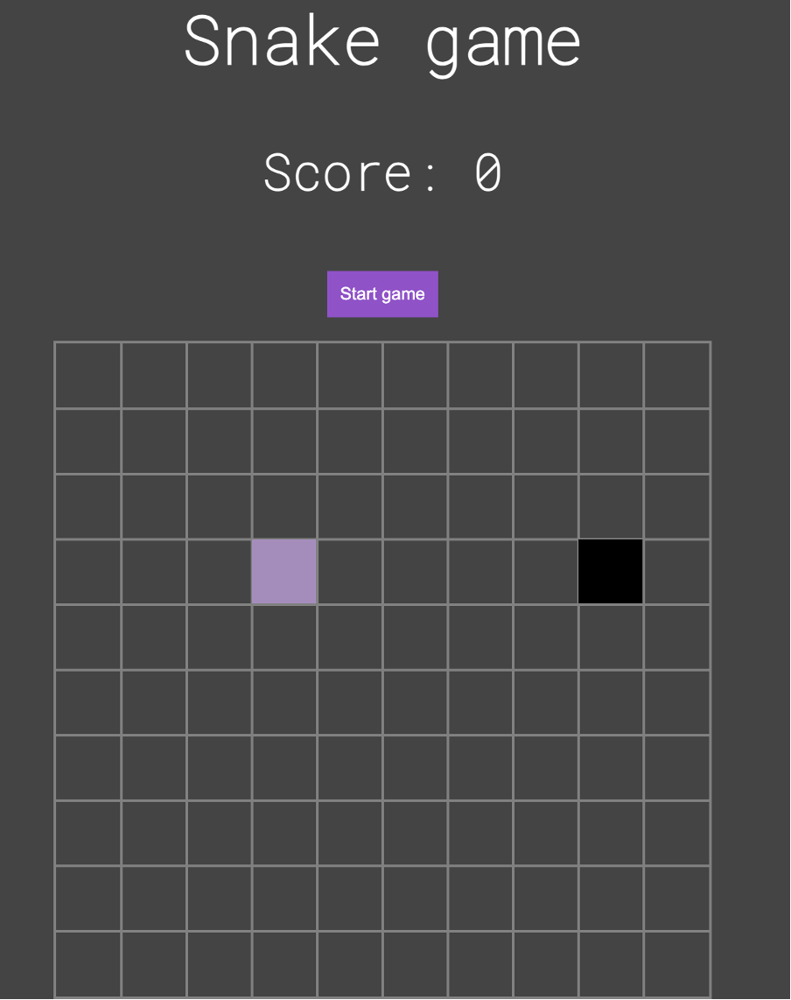
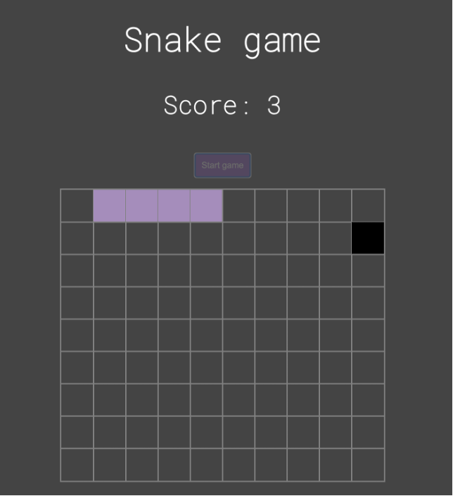
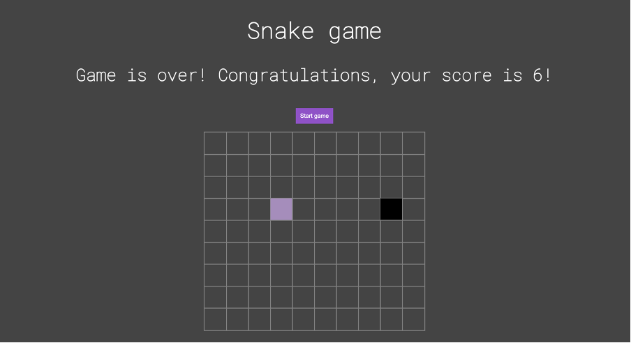

# Snake game

## Description

Snake game is a school project done on a course called Databases and data structures at Business College Helsinki. You can move the snake with arrow keys. When the snake reaches food, your score is increased by one. The game ends if the snake moves out of the platform or it eats itself.

## Technologies used

- React

## Visuals

Game start:

Game going on:

Game over:

## Sources

See YouTube video ([I built A Snake Game By Reversing A Linked List (JavaScript & React project tutorial)](https://www.youtube.com/watch?v=7Rkib_fvowE)) and [GitHub repository](https://github.com/clementmihailescu/Snake-Game-Reverse-LL-Tutorial) by Clément Mihailescu
